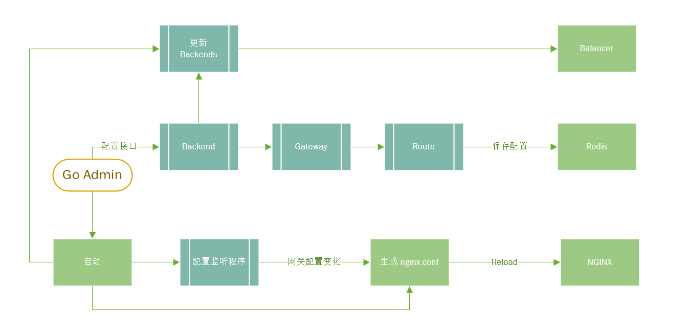
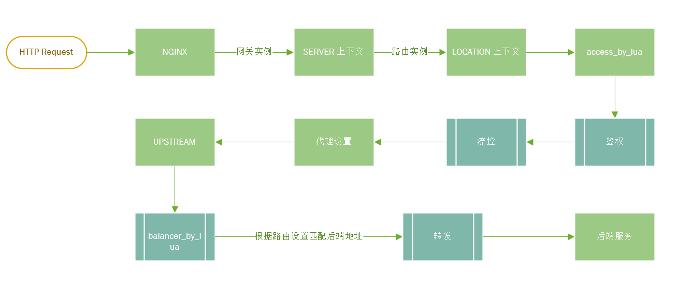

# Nginx 网关

## 介绍

- `go-admin` 负责维护配置
- `openresty/nginx` 处理路由转发、鉴权、流控等功能
- `gateway` 网关实例，对应一个 nginx `server {}`
- `route` 路由实例，对应一个 nginx `location {}`
- `backend` 一个后端实例，对应一个 nginx `upstream {}`

一个网关通常有一个三级域名，不同的服务(`route`)通过请求的路径区分，比如`http://apigw.example.com/order-service/api` 会转发到后端服务 `/api` 路径

`gateway` `route` 配置更新需要 `nginx reload` `backend` 配置可以热更新

### 管理流程



### 请求流程



## 部署

go-admin 配置样例 `config/config-example.yaml`

```shell
# 启动 openresty
git clone https://github.com/sanmuyan/nginx-gateway.git
cd nginx-gateway
cp -r openresty/lualib/balancer openresty_path
cd openresty_path
./nginx

# 启动 go admin
go build -o go-admin cmd/admin/admin.go
./go-admin -c config.yaml
```

## 配置

### 网关实例配置

#### 创建一个网关

```json
{
  "gateway_name": "test-gateway",
  "listen_port": 8080,
  "host": "api-gw.example.com",
  "auth_request": {
    "enable": true,
    "auth_path": "/auth",
    "proxy_pass": "http://127.0.0.1:10001"
  },
  "route_names": [
    "order-service"
  ]
}
```

```shell
curl -XPOST 'http://127.0.0.1:9000/api/gateway' \
  -H 'Content-Type: application/json' \
  --data '{}'
```

#### 创建一个路由

```json
{
  "route_name": "order-service",
  "route_path": "order-service",
  "backend_name": "backend2",
  "annotations": {
    "auth": {
      "enable": true,
      "auth_type": "token",
      "token": "Bearer test-token"
    },
    "limit_traffic": {
      "req_rate": 200,
      "req_burst": 100,
      "conn_max": 200,
      "conn_burst": 100
    },
    "whitelist": [
      "127.0.0.1"
    ]
  }
}
```

```shell
curl -XPOST 'http://127.0.0.1:9000/api/route' \
-H 'Content-Type: application/json' \
--data '{}'
```

#### 创建一个后端

```json
{
  "backend_name": "backend2",
  "health_check": {
    "enable": true,
    "type": "http",
    "uri": "/ping",
    "interval": 3,
    "timeout": 2,
    "success": 2,
    "fail": 3
  },
  "servers": [
    {
      "addr": "127.0.0.1",
      "port": 10001,
      "weight": 10
    },
    {
      "addr": "127.0.0.1",
      "port": 10002,
      "weight": 1
    }
  ]
}
```

```shell
curl -XPOST 'http://127.0.0.1:9000/api/backend' \
-H 'Content-Type: application/json' \
--data '{}'
```

#### Reload Nginx

修改网关或路由配置需要 Reload Nginx

```shell
curl 'http://127.0.0.1:9000/api/reload'
```

#### 测试

```shell
curl 'http://apigw.example.com/order-service/api' \
-H 'Authorization: Bearer test-token'

# 会转发到 http://127.0.0.1:10001/api
```
